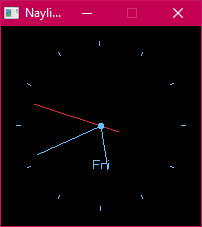

# naylib_analogue_clock

An analogue clock that I made to learn [Naylib](https://github.com/planetis-m/naylib) & [Nim](https://nim-lang.org/)

Use `run.ps1` to run in debug mode

Use `release.ps1` to build the exe & assign the ICO file using `rcedit`, which you can get here: https://github.com/electron/rcedit
